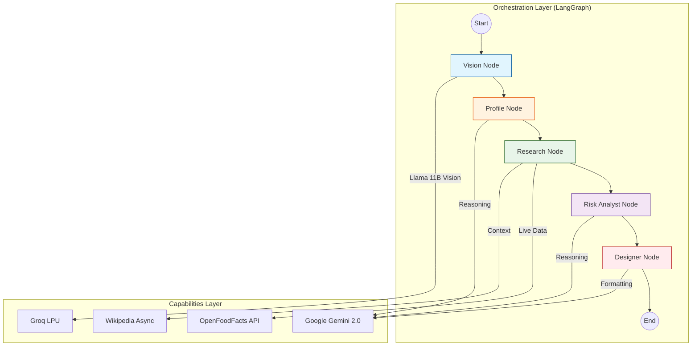

# 🏥 Health Agent FastAPI Server (IngrediSense Brain)

> **AI-Powered Clinical Reasoning Engine**
> The intelligence core that orchestrates vision, reasoning, and medical analysis using a multi-agent LangGraph workflow.


---

## 📑 Table of Contents

- [1. 🎯 Overview & Intelligence](#1--overview--intelligence)
- [2. 🏗 LangGraph Architecture](#2--langgraph-architecture)
- [3. ✨ Core Capabilities](#3--core-capabilities)
- [4. 🛠 Technology Stack](#4--technology-stack)
- [5. 📂 Project Structure](#5--project-structure)
- [6. 🚀 Prerequisites & Setup](#6--prerequisites--setup)
- [7. 🔐 Environment Configuration](#7--environment-configuration)
- [8. 🔌 API Reference](#8--api-reference)
- [9. 🔄 Workflow Logic Deep Dive](#9--workflow-logic-deep-dive)
- [10. 🐛 Troubleshooting](#10--troubleshooting)

---

## 1. 🎯 Overview & Intelligence

The **Health Agent FastAPI Server** is the "Think Tank" of IngrediSense. It uses a **Cognitive Architecture** to simulate how a team of specialists would analyze a food label.

### The "Thinking" Process (Hybrid AI Strategy)
1.  **Vision Specialist (Groq/Llama)**: Uses **Llama-3.2-11B-Vision** on Groq's LPU to instantly read ingredients and nutrition tables from images.
2.  **Clinical Profiler (Gemini)**: Translates user symptoms (e.g., "I have IBS") into biochemical triggers ("Avoid Fructans/Polyols").
3.  **Researcher (LangChain)**: Fetches real-world data (Wiki + OpenFoodFacts) for every ingredient.
4.  **Risk Analyst (Gemini)**: Cross-references specific ingredients against the user's unique bio-profile.
5.  **UX Designer (Gemini)**: Formats the final verdict into a friendly, color-coded response.

---

## 2. 🏗 LangGraph Architecture

We use a directed cyclic graph (DAG) to manage the flow of information between specialized agents.



---

## 3. ✨ Core Capabilities

### ⚡ Blazing Fast Vision (Groq)
*   **Llama 3.2 Vision Integration**: We replaced traditional OCR (Tesseract) with **Llama-3.2-11B-Vision** running on Groq hardware.
*   **Why?**: It understands *structure*. It doesn't just read text; it identifies "Serving Size" vs "Total Fat" even in complex table layouts.

### 🧬 Dynamic Clinical Profiling
*   **Symptom-to-Trigger Mapping**: Automatically converts "I feel bloated after bread" -> "Sensitivity: Gluten/Fructans".
*   **Precision Filtering**: Differentiates between "May contain traces" (Caution) and "Main Ingredient" (Danger).

### 🎨 Intelligent UX Response
*   **Color-Coded Verdicts**: The AI autonomously assigns a hex code (e.g., `#EF4444` Red, `#22C55E` Green) based on risk severity.
*   **Anti-Jargon Protocol**: "Immune response" instead of "Mast cell degranulation".

---

## 4. 🛠 Technology Stack

| Category | Technology | Purpose |
| :--- | :--- | :--- |
| **Framework** | FastAPI | High-performance Async API |
| **Orchestration** | LangGraph | Stateful Multi-Agent Workflows |
| **Vision Model** | **Groq Llama 3.2 11B** | Ultra-fast Image Analysis |
| **Reasoning Model** | Google Gemini 2.0 | Complex Medical Logic |
| **Data Source** | OpenFoodFacts API | Ingredient Categories & Nutrition |
| **Data Source** | Wikipedia | Ingredient Definitions |
| **Validation** | Pydantic v2 | Strict JSON Schema |

---

## 5. 📂 Project Structure

```text
FASTAPISERVER/
├── app/
│   ├── api/routes/         # 🚦 Endpoints
│   │   └── health_analysis.py
│   ├── services/
│   │   └── health_agent/   # 🧠 THE AI BRAIN
│   │       ├── nodes.py    # 🤖 Agent Definitions
│   │       ├── workflow.py # 🕸️ Graph Logic
│   │       ├── tools.py    # 🛠️ Groq Vision & Scrapers
│   │       └── state.py    # 💾 Shared Memory
│   ├── middleware/         # 🌐 CORS & Errors
│   ├── models/             # 📥 Pydantic Schemas
│   └── main.py             # 🏁 App Entry
├── uploads/                # 🗑️ Temp Storage
├── .env.example            # 🔐 Config Template
├── requirements.txt        # 📦 Python Deps
└── run.py                  # 🏃 Server Runner
```

---

## 6. 🚀 Prerequisites & Setup

### Required Keys
1.  **Google AI Key**: For Gemini Reasoning.
    *   Get at: `aistudio.google.com`
2.  **Groq Cloud Key**: For Llama Vision (Free Tier available).
    *   Get at: `console.groq.com`

### Installation
1.  **Clone & Enter**:
    ```bash
    cd FASTAPISERVER
    ```
2.  **Virtual Env**:
    ```bash
    python -m venv venv
    source venv/bin/activate
    ```
3.  **Install Deps**:
    ```bash
    pip install -r requirements.txt
    ```

---

## 7. 🔐 Environment Configuration

Create `.env` file. These keys are mandatory.

```properties
# Intelligence Providers
GOOGLE_API_KEY=your_google_key_here
GROQ_API_KEY=your_groq_key_here

# Model Selection
GEMINI_MODEL=gemini-2.0-flash-exp

# Server Settings
HOST=0.0.0.0
PORT=8000
DEBUG=True

# File Limits
MAX_FILE_SIZE=10485760 # 10MB
UPLOAD_DIR=uploads

# CORS (Frontend Access)
CORS_ORIGINS=http://localhost:5173,http://localhost:3000
```

---

## 8. 🔌 API Reference

### Health Check
`GET /api/v1/health`
*   **Returns**: `{ status: "healthy", version: "1.0.0" }`

### Analyze Label (Deep Scan)
`POST /api/v1/analyze`
*   **Headers**: `Content-Type: multipart/form-data`
*   **Body**:
    *   `file`: The image file (JPG/PNG).
    *   `user_health_profile` (String): e.g., "I have Type 2 Diabetes".
*   **Response**:
    ```json
    {
      "success": true,
      "brand_name": "Lays Classic",
      "clinical_risk_analysis": "High Sodium content poses risk...",
      "final_conversational_insight": "...",
      "decision_color": "#F97316"
    }
    ```

---

## 9. 🔄 Workflow Logic Deep Dive

### Node 1: `extract_label_info` (Groq/Llama)
*   **Input**: Raw Image Base64.
*   **Action**: Sends to `meta-llama/llama-3.2-11b-vision-preview` on Groq.
*   **Task**: "Extract brand, ingredient list, and nutrition table values".
*   **Output**: Structured JSON with `nutrition_facts` (Calories, Fat, Sodium, etc.).

### Node 2: `map_clinical_profile` (Gemini)
*   **Input**: User's raw explanation ("I'm keto").
*   **Action**: Maps "Keto" -> "Limit Carbohydrates < 50g, Sugars < 10g".

### Node 3: `researcher_node` (Tool Use)
*   **Action**:
    1.  **Wikipedia**: Async fetch of ingredient definitions.
    2.  **OpenFoodFacts**: Fetches product category (e.g., "Snacks") and healthier alternatives available in the region.

### Node 4: `risk_analyzer_node` (Gemini)
*   **Action**: Synthesizes (Profile Constraints + Ingredient Risks + Nutrition Amounts).
*   **Logic**: "If Sodium > 500mg AND User has Hypertension THEN Flag Red".

### Node 5: `conversational_designer_node` (Gemini)
*   **Action**:
    1.  Drafts "Quick Decision" (Safe/Caution/Skip).
    2.  Assigns Hex Color.
    3.  Formats as Markdown.

---

## 10. 🐛 Troubleshooting

| Issue | Solution |
| :--- | :--- |
| **`Groq API Error`** | Check `GROQ_API_KEY` in `.env`. Ensure your account has Vision access. |
| **`403 Forbidden`** | Check `GOOGLE_API_KEY`. Billing must be enabled (even for free tier). |
| **`ImportError`** | Run `pip install -r requirements.txt`. |
| **`CORS Error`** | Add your frontend URL to `CORS_ORIGINS` in `.env`. |
| **File too large** | Increase `MAX_FILE_SIZE` in `.env`. |

---

**Built with 🧠 AGENTIC AI for ENCODE 2026 Hackathon**
