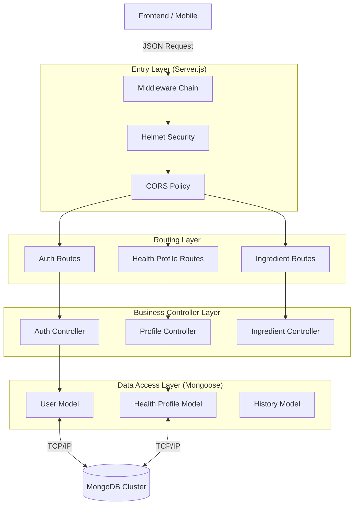
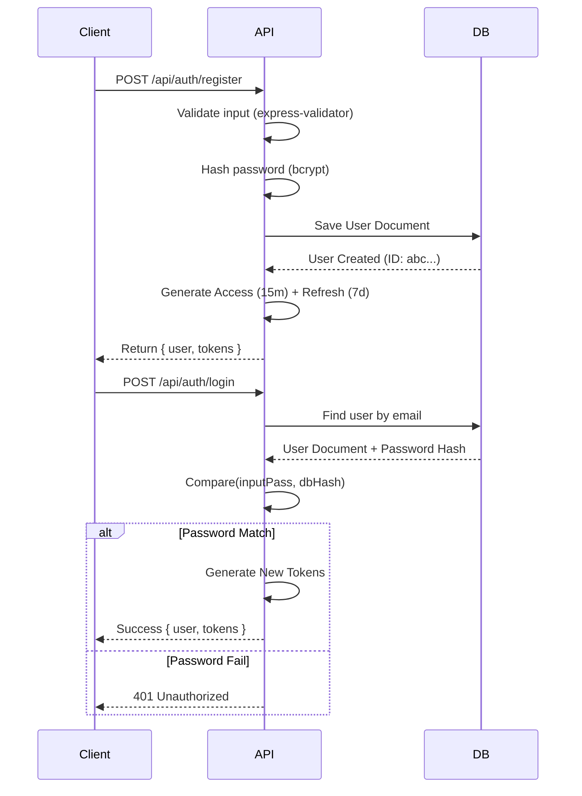
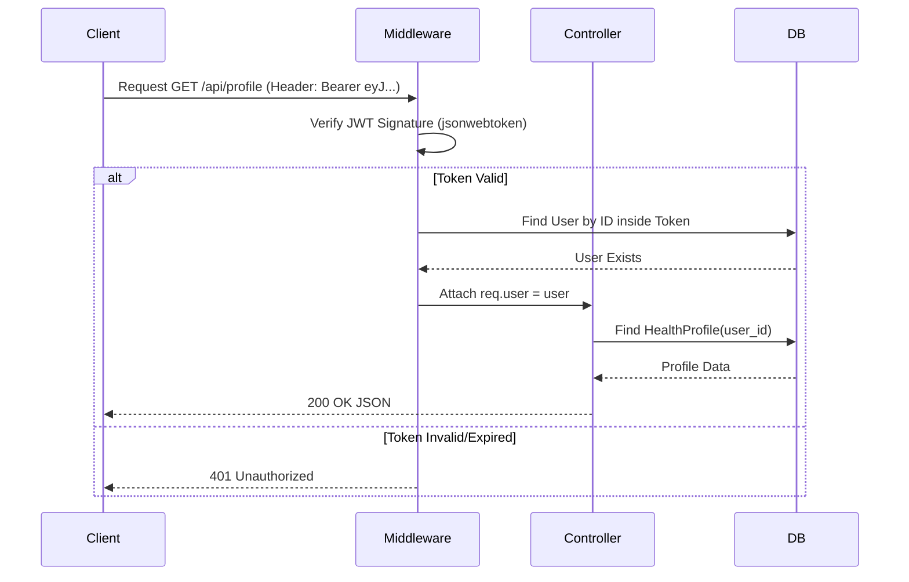

# 🔐 IngrediSense Node Server

> **Enterprise-Grade Identity & Health Logic Microservice**
> Secure, scalable, and built for the future of Health AI.


---

## � Table of Contents

- [1. 🎯 Overview & Scope](#1--overview-scope)
- [2. 🏗 System Architecture](#2--system-architecture)
- [3. ✨ Deep Feature Analysis](#3--deep-feature-analysis)
- [4. 🛠 Technology Stack](#4--technology-stack)
- [5. 📂 Full Project Map](#5--full-project-map)
- [6. 🚀 Prerequisites & Setup](#6--prerequisites--setup)
- [7. 🔐 Environment Configuration](#7--environment-configuration)
- [8. 🔌 API Reference (Deep Dive)](#8--api-reference-deep-dive)
    - [8.1 Authentication](#81-authentication)
    - [8.2 Health Profile](#82-health-profile)
    - [8.3 Ingredients & Scanning](#83-ingredients--scanning)
- [9. 💾 Database Schemas](#9--database-schemas)
- [10. 🔄 Logic Flow Diagrams](#10--logic-flow-diagrams)
- [11. 🐛 Error Handling & Logging](#11--error-handling--logging)
- [12. 🐛 Troubleshooting](#12--troubleshooting)

---

## 1. 🎯 Overview & Scope

The **Node Server** is the **Central Nervous System** of the IngrediSense platform. While the Frontend handles user interaction and the FastAPI server handles "Thinking" (AI Analysis), this Node.js microservice is responsible for **Identity, Data Persistence, and Security**.

### Key Responsibilities
*   **Identity Provider (IdP)**: Manages 2-Factor Authentication (Email + Password) and JWT Session Management.
*   **Health Ledger**: Stores sensitive medical context (Allergies, Diabetes, etc.) distinct from user credentials.
*   **Scan Archivist**: Maintains a permanent record of every analysis performed by the AI, enabling historical tracking.
*   **Gateway**: Validates every request before it touches the database, ensuring zero-trust security.

---

## 2. 🏗 System Architecture

We employ a **Controller-Service-Model** architecture to decouple business logic from HTTP transport layers.



---

## 3. ✨ Deep Feature Analysis

### 🛡️ Enterprise-Grade Security
*   **JWT Rotation Architecture**: We implement a dual-token strategy.
    *   **Access Token**: Short-lived (15 minutes). Used for API calls. Stolen tokens have limited impact.
    *   **Refresh Token**: Long-lived (7 days). Used *only* to get new access tokens. Can be revoked server-side.
*   **Password Hardening**: Passwords are **never** stored in plain text. We use `bcrypt` with `saltRounds=12`, making rainbow table attacks computationally infeasible.
*   **Helmet Headers**: Automatically sets `Strict-Transport-Security`, `X-Frame-Options`, and `X-Content-Type-Options`.

### 👤 Granular Health Context
*   **Flexible Schema**: The `HealthProfile` model uses a `Map` type for `stats`, allowing users to store arbitrary key-value pairs (e.g., "Insulin Sensitivity", "Activity Level") without database migrations.
*   **Medical Separation**: User Credentials (`User.model`) are decoupled from Health Data (`HealthProfile.model`), improving security and privacy.

### ⚡ Performance
*   **Custom Logger**: A dedicated `Logger` class (`src/utils/logger.js`) handles distinct log levels (`info`, `warn`, `error`) and writes to the filesystem (`logs/`) for persistent auditing, unlike simple `console.log`.

---

## 4. 🛠 Technology Stack

| Category | Technology | Version | Purpose |
| :--- | :--- | :--- | :--- |
| **Runtime** | Node.js | v18.x | V8 Javascript Engine |
| **Framework** | Express | v5.2.1 | HTTP Server & Routing |
| **Database** | MongoDB | v7.0 | Document Store |
| **ODM** | Mongoose | v9.1.1 | Schema Validation |
| **Auth** | JWT (jsonwebtoken) | v9.0 | Stateless Session Tokens |
| **Encryption** | Bcrypt.js | v3.0 | Password Hashing |
| **Security** | Helmet | v8.1 | Header Hardening |
| **Validation** | Express-Validator | v7.3 | Request Body Checking |
| **Logging** | Morgan + Custom | v1.10 | Traffic Analysis |

---

## 5. 📂 Full Project Map

```text
NodeServer/
├── src/
│   ├── config/                # ⚙️ App Configuration
│   │   ├── env.config.js      # Environment Loader
│   │   └── db.config.js       # Database Connector
│   ├── controllers/           # 🧠 Business Logic (The "Brain")
│   │   ├── auth.controller.js
│   │   ├── profile.controller.js
│   │   └── ingredient.controller.js # Logic for /ingredients/*
│   ├── middleware/            # 🛡️ Request Policemen
│   │   ├── auth.middleware.js # "Verify Token" Guard
│   │   ├── errorHandler.js    # "Catch All" Exception Handler
│   │   ├── notFound.js        # 404 Handler
│   │   └── validators/        # Validation Rules
│   │       └── auth.validator.js
│   ├── models/                # 💾 Database Blueprints
│   │   ├── User.model.js      # Identity Schema
│   │   └── HealthProfile.model.js # Medical Context Schema
│   ├── routes/                # 🚦 URL Directions
│   │   ├── index.js           # Main Traffic Hub (/api)
│   │   ├── auth.routes.js     # /auth/*
│   │   ├── profile.routes.js  # /profile/*
│   │   └── ingredient.routes.js # /ingredients/*
│   ├── utils/                 # 🔧 Helper Tools
│   │   ├── jwt.util.js        # Token Generators
│   │   └── logger.js          # File-based logging system
│   └── server.js              # 🏁 App Entry Point
├── logs/                      # 📝 Generated Log Files
├── .env.example               # Env Variable Template
├── package.json               # Dependencies
└── README.md                  # This documentation
```

---

## 6. 🚀 Prerequisites & Setup

### Required Software
*   **Node.js 18+**
    ```bash
    node --version
    # v18.17.0 or higher
    ```
*   **MongoDB**: Local installation or Atlas URI
    ```bash
    mongod --version
    ```

### Setup Steps
1.  **Clone & Enter**:
    ```bash
    cd NodeServer
    ```
2.  **Install**:
    ```bash
    npm install
    # or yarn install
    ```
3.  **Start DB** (If local):
    ```bash
    brew services start mongodb-community
    ```

---

## 7. 🔐 Environment Configuration

Create a `.env` file from the example.

```properties
# Server Listener
PORT=8080
NODE_ENV=development

# Database Connection (Critical)
MONGODB_URI=mongodb://localhost:27017/ingredisense

# Security Secrets (Must be 32+ chars)
JWT_SECRET=super_secret_signing_key_for_access_token
JWT_REFRESH_SECRET=super_secret_signing_key_for_refresh_token

# Token Lifespans
JWT_EXPIRE=15m          # Short life for security
JWT_REFRESH_EXPIRE=7d   # Long life for convenience

# Crypto
BCRYPT_ROUNDS=12

# CORS (Must match Frontend Port)
FRONTEND_URL=http://localhost:5173
```

---

## 8. 🔌 API Reference (Deep Dive)

### 8.1 Authentication

| Method | Endpoint | Description | Auth |
| :--- | :--- | :--- | :--- |
| `POST` | `/api/auth/register` | Register new user | ❌ |
| `POST` | `/api/auth/login` | Login & Get Tokens | ❌ |
| `GET` | `/api/auth/me` | Get Own Profile | ✅ |
| `PUT` | `/api/auth/profile` | Update User Details | ✅ |
| `POST` | `/api/auth/refresh-token` | Rotate Access Token | ❌ |

### 8.2 Health Profile

| Method | Endpoint | Description | Auth |
| :--- | :--- | :--- | :--- |
| `GET` | `/api/profile` | Get Health Context | ✅ |
| `PUT` | `/api/profile` | Update Health Context | ✅ |

### 8.3 Ingredients & Scanning

| Method | Endpoint | Description | Auth |
| :--- | :--- | :--- | :--- |
| `GET` | `/api/ingredients` | List all tracked ingredients | ❌ |
| `POST` | `/api/ingredients/analyze` | Submit text for analysis | ❌ |
| `POST` | `/api/ingredients/scan` | Submit image for OCR | ❌ |

---

## 9. 💾 Database Schemas

### User Model (`User.model.js`)
Stores crucial identity information.

| Field | Type | Modifiers | Description |
| :--- | :--- | :--- | :--- |
| `name` | String | `min:2`, `max:50` | Display name |
| `email` | String | `unique`, `index` | Login identifier |
| `password` | String | `select: false` | Hashed credential (never returned by default) |
| `role` | String | `enum: ['user', 'admin']` | RBAC control |
| `isEmailVerified` | Boolean | `default: false` | Future proofing for simple email verify |

**Hooks**:
*   `pre('save')`: Automatically hashes password if modified.
*   `matchesPassword()`: Instance method to compare plain text vs hash.

### HealthProfile Model (`HealthProfile.model.js`)
Decoupled schema for medical data.

| Field | Type | Description |
| :--- | :--- | :--- |
| `user` | ObjectId | 1:1 Link to User |
| `allergies` | [String] | Critical restrictions |
| `conditions` | [String] | Medical diagnoses |
| `stats` | Map<String> | Flexible K/V pairs (Age, Weight) |

---

## 10. 🔄 Logic Flow Diagrams

### Authentication: Registration & Login
The core flow for user onboarding and session creation.



### Protected Route Access
How the middleware guards sensitive data.



---

## 11. 🐛 Error Handling & Logging

All errors are routed through `src/middleware/errorHandler.js`, ensuring a consistent JSON structure for the frontend to consume.

**Error Response Format**:
```json
{
  "status": "error",
  "statusCode": 404,
  "message": "User not found",
  "stack": "..." // (Only in Development)
}
```

**Logging System**:
Logs are written to the `/logs` directory for audit trails:
*   `logs/info.log`: General traffic
*   `logs/error.log`: Critical failures
*   `logs/warn.log`: Deprecated usage or bad input

---

## 12. 🐛 Troubleshooting

| Error | Cause | Solution |
| :--- | :--- | :--- |
| `EADDRINUSE: 8080` | Port blocked | Kill process `lsof -i :8080` or change `.env` PORT. |
| `MongoNetworkError` | DB Down | Start Mongo: `brew services start mongodb-community`. |
| `JsonWebTokenError` | Bad Secret | Ensure `JWT_SECRET` in `.env` matches the token signer. |
| `Cors Policy Block` | Origin Mismatch | Check `FRONTEND_URL` in `.env`. Must match React URL exactly. |
| `401 Unauthorized` | Catch-All | Token might be expired. Try `/auth/refresh-token`. |

---

**Built with 🛡️ Security First for ENCODE 2026 Hackathon**
