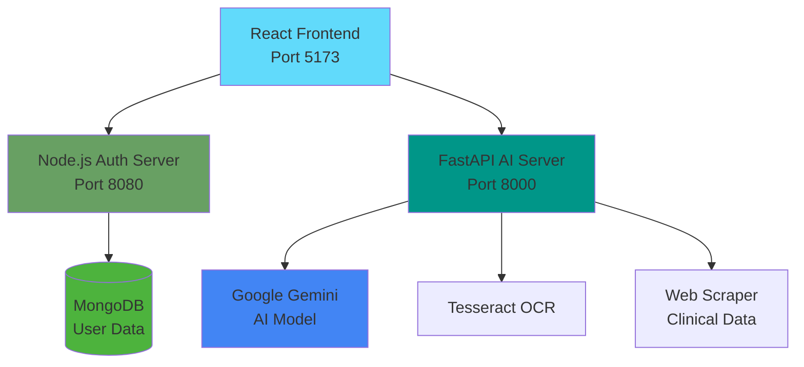

# 🏥 AI Health Ingredient Copilot

> **ENCODE 2026 Hackathon @ IIT Guwahati**  
> AI-powered food ingredient analysis and health risk assessment platform


## 📋 Table of Contents

- [Overview](#overview)
- [Features](#features)
- [Architecture](#architecture)
- [Technology Stack](#technology-stack)
- [Prerequisites](#prerequisites)
- [Quick Start](#quick-start)
- [Project Structure](#project-structure)
- [Development](#development)
- [Deployment](#deployment)
- [Contributing](#contributing)
- [License](#license)
- [Team](#team)

## 🎯 Overview

**AI Health Ingredient Copilot** is an intelligent health analysis platform that helps users make informed decisions about food products by analyzing ingredient labels using advanced AI. The system extracts ingredients from product images, assesses health risks based on user profiles, and provides personalized recommendations.

### Key Capabilities

- 📸 **OCR-based Label Extraction** - Extract brand names and ingredient lists from food labels
- 🧬 **Clinical Profile Mapping** - Convert health conditions to biochemical triggers
- 🔬 **Evidence-based Analysis** - Fetch clinical research and regulatory data for ingredients
- ⚠️ **Risk Assessment** - Identify potential health risks based on user profile
- 💡 **Smart Recommendations** - Suggest healthier product alternatives
- 🤖 **Conversational AI** - Friendly expert insights with visual indicators (🟢/🟡/🔴)

## ✨ Features

### Core Features

- **🔐 User Authentication** - Secure JWT-based authentication system
- **👤 Health Profiling** - Personalized health condition tracking
- **📊 Real-time Analysis** - Instant AI-powered ingredient assessment
- **🎯 Risk Scoring** - NOVA classification and health risk indicators
- **📱 Responsive Design** - Beautiful UI across all devices
- **🌐 Multi-modal Input** - Support for image upload and URL analysis
- **📈 History Tracking** - Save and review past analyses

### Advanced Features

- **LangGraph Workflow** - Sophisticated AI agent pipeline
- **Google Gemini Integration** - State-of-the-art AI model
- **Clinical Evidence Search** - Real-time medical research lookup
- **Regulatory Database** - International food safety regulations
- **Alternative Suggestions** - Healthier product recommendations

## 🏗 Architecture



### System Components

1. **Frontend (React + Vite)**
   - User interface and interaction
   - Authentication flow
   - Health profile management
   - Real-time analysis display

2. **Node Server (Express + MongoDB)**
   - User authentication (JWT)
   - Health profile storage
   - Session management
   - User data persistence

3. **FastAPI Server (Python + LangGraph)**
   - AI health agent workflow
   - Image OCR processing
   - Ingredient analysis
   - Clinical risk assessment
   - Alternative recommendations

## 🛠 Technology Stack

### Frontend
- **Framework**: React 19.2.0
- **Build Tool**: Vite 7.2.4
- **Styling**: TailwindCSS 4.1.18
- **Animations**: Framer Motion 12.23.26
- **Routing**: React Router DOM 7.11.0
- **HTTP Client**: Axios 1.13.2
- **Icons**: React Icons 5.5.0

### Backend (Node Server)
- **Runtime**: Node.js 18+
- **Framework**: Express 5.2.1
- **Database**: MongoDB + Mongoose 9.1.1
- **Authentication**: JWT (jsonwebtoken 9.0.3)
- **Security**: Helmet 8.1.0, bcryptjs 3.0.3
- **Logging**: Morgan 1.10.1

### Backend (FastAPI Server)
- **Framework**: FastAPI 0.115.6
- **Server**: Uvicorn 0.34.0
- **AI/ML**: LangChain 0.3.14, LangGraph 0.2.64
- **LLM**: Google Generative AI 0.8.3
- **OCR**: Tesseract, OpenCV 4.10.0
- **Image Processing**: Pillow 11.0.0
- **Web Scraping**: BeautifulSoup4 4.12.3

## 📦 Prerequisites

### Required Software

- **Node.js** 18+ ([Download](https://nodejs.org/))
- **Python** 3.10+ ([Download](https://www.python.org/))
- **MongoDB** ([Download](https://www.mongodb.com/try/download/community) or use [MongoDB Atlas](https://www.mongodb.com/cloud/atlas))
- **Tesseract OCR** ([Installation Guide](https://tesseract-ocr.github.io/tessdoc/Installation.html))

### macOS Setup
```bash
# Install Homebrew (if not installed)
/bin/bash -c "$(curl -fsSL https://raw.githubusercontent.com/Homebrew/install/HEAD/install.sh)"

# Install required software
brew install node python tesseract mongodb-community
```

### API Keys Required

- **Google AI API Key** - Get from [Google AI Studio](https://makersuite.google.com/app/apikey)

## 🚀 Quick Start

### 1. Clone the Repository
```bash
git clone <repository-url>
cd "ENCODE 2026 HACKATHON IIT GUWAHATI"
```

### 2. Setup Frontend
```bash
cd frontend
npm install
cp .env.example .env
# Edit .env and configure API URLs
npm run dev
```
Frontend will run at: **http://localhost:5173**

### 3. Setup Node Server
```bash
cd NodeServer
npm install
cp .env.example .env
# Edit .env and add MongoDB URI, JWT secrets
npm run dev
```
Node server will run at: **http://localhost:8080**

### 4. Setup FastAPI Server
```bash
cd FASTAPISERVER
python -m venv venv
source venv/bin/activate  # On Windows: venv\Scripts\activate
pip install -r requirements.txt
cp .env.example .env
# Edit .env and add Google API key
python run.py
```
FastAPI server will run at: **http://localhost:8000**

### 5. Access the Application
- **Frontend**: http://localhost:5173
- **Node API**: http://localhost:8080/health
- **FastAPI Docs**: http://localhost:8000/docs

## 📁 Project Structure

```
ENCODE 2026 HACKATHON IIT GUWAHATI/
├── frontend/                 # React + Vite frontend
│   ├── src/
│   │   ├── components/      # Reusable UI components
│   │   ├── pages/          # Route pages
│   │   ├── services/       # API integration
│   │   ├── context/        # React context (auth)
│   │   └── assets/         # Static assets
│   ├── .env.example
│   └── package.json
│
├── NodeServer/              # Express + MongoDB backend
│   ├── src/
│   │   ├── routes/         # API routes
│   │   ├── controllers/    # Request handlers
│   │   ├── models/         # Mongoose models
│   │   ├── middleware/     # Custom middleware
│   │   ├── config/         # Configuration
│   │   └── utils/          # Utilities
│   ├── .env.example
│   └── package.json
│
├── FASTAPISERVER/           # FastAPI + AI backend
│   ├── app/
│   │   ├── api/routes/     # API endpoints
│   │   ├── services/       # Business logic
│   │   │   └── health_agent/ # LangGraph AI agent
│   │   ├── models/         # Pydantic models
│   │   ├── middleware/     # Middleware
│   │   ├── config/         # Settings
│   │   └── utils/          # Utilities
│   ├── uploads/            # Temporary files
│   ├── logs/               # Application logs
│   ├── .env.example
│   └── requirements.txt
│
├── .gitignore
└── README.md               # This file
```

## 💻 Development

### Frontend Development

```bash
cd frontend
npm run dev      # Start dev server with HMR
npm run build    # Build for production
npm run preview  # Preview production build
npm run lint     # Run ESLint
```

### Node Server Development

```bash
cd NodeServer
npm run dev      # Start with nodemon (auto-restart)
npm start        # Start production server
```

### FastAPI Server Development

```bash
cd FASTAPISERVER
source venv/bin/activate  # Activate virtual environment
python run.py             # Start with auto-reload
uvicorn app.main:app --reload  # Alternative start method
```

### Environment Variables

Each service requires specific environment variables. Copy `.env.example` to `.env` in each directory and configure:

- **Frontend**: API URLs, feature flags
- **Node Server**: MongoDB URI, JWT secrets, CORS origins
- **FastAPI Server**: Google API key, server config, OCR settings

## 🌐 Deployment

### Frontend (Vercel/Netlify)
```bash
cd frontend
npm run build
# Deploy dist/ folder
```

### Node Server (Railway/Render)
- Set environment variables in platform dashboard
- Ensure MongoDB connection string is configured
- Use start command: `npm start`

### FastAPI Server (Render/Railway)
- Set environment variables
- Install Tesseract in build script
- Use start command: `uvicorn app.main:app --host 0.0.0.0 --port $PORT`

**Build Script for FastAPI (Render)**:
```bash
#!/usr/bin/env bash
apt-get update && apt-get install -y tesseract-ocr
pip install -r requirements.txt
```

## 🤝 Contributing

This project was built for the ENCODE 2026 Hackathon at IIT Guwahati.

### Development Workflow

1. Create a feature branch
2. Make your changes
3. Test thoroughly
4. Submit a pull request

### Code Style

- **Frontend**: ESLint rules defined in `eslint.config.js`
- **Python**: Follow PEP 8 guidelines
- **JavaScript**: ES6+ modern syntax

## 📄 License

ISC License - See LICENSE file for details

## 👥 Team

**ENCODE 2026 Team**  
IIT Guwahati

---

## 📚 Additional Resources

- [Frontend README](frontend/README.md)
- [Node Server README](NodeServer/README.md)
- [FastAPI Server README](FASTAPISERVER/README.md)

## 🐛 Troubleshooting

### Common Issues

**MongoDB Connection Failed**
- Ensure MongoDB is running: `brew services start mongodb-community`
- Check connection string in `.env`

**Tesseract Not Found**
- Install via Homebrew: `brew install tesseract`
- Verify installation: `tesseract --version`

**Port Already in Use**
- Check running processes: `lsof -i :PORT`
- Kill process or change port in `.env`

**CORS Errors**
- Verify CORS_ORIGINS in server `.env` files
- Ensure frontend URL is whitelisted

---

**Built with ❤️ for ENCODE 2026 Hackathon**
