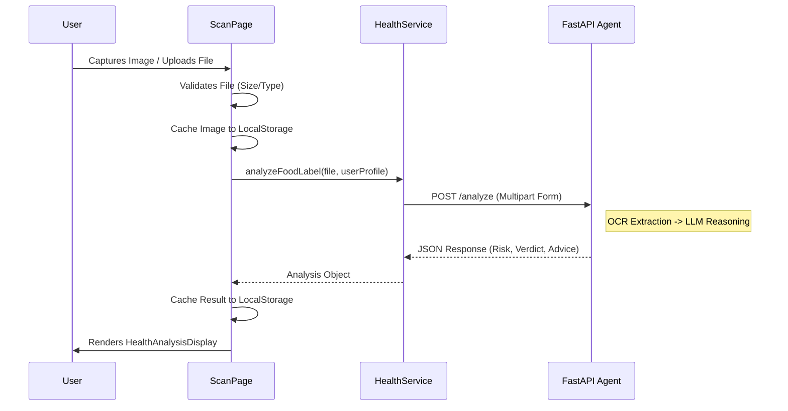
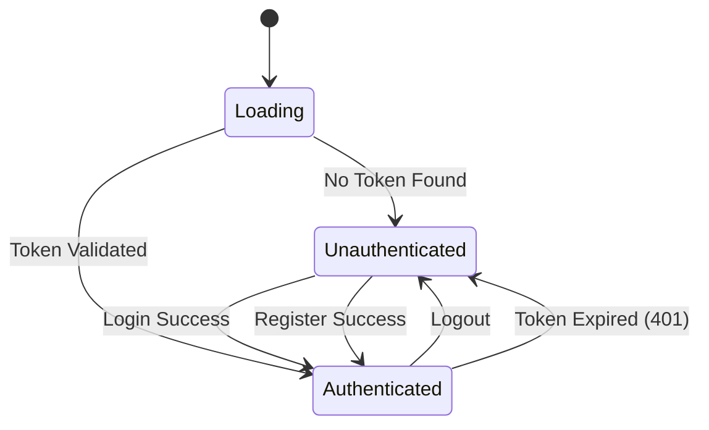

# 🎨 IngrediSense Frontend: The AI Health Co-Pilot

> **A Next-Generation Health Intelligence Interface**
> Built with React 19, Vite, TailwindCSS 4, and Agentic AI Integration.


---

## 📑 Table of Contents

- [1. 🌟 Vision & Overview](#1--vision--overview)
- [2. 🏗 High-Level Architecture](#2--high-level-architecture)
- [3. ✨ Key Features Breakdown](#3--key-features-breakdown)
- [4. 💻 Technology Stack Deep Dive](#4--technology-stack-deep-dive)
- [5. 📂 Comprehensive Project Structure](#5--comprehensive-project-structure)
- [6. ⚙️ Component Architecture & Logic](#6--component-architecture--logic)
    - [6.1 The Analysis Pipeline](#61-the-analysis-pipeline)
    - [6.2 Authentication System](#62-authentication-system)
    - [6.3 Dashboard & Widget System](#63-dashboard--widget-system)
- [7. 🔌 API Integration Layer](#7--api-integration-layer)
- [8. 🚀 Setup & Installation Guide](#8--setup--installation-guide)
- [9. 🎨 Design System & Styling](#9--design-system--styling)
- [10. 🌍 Deployment Strategy](#10--deployment-strategy)
- [11. 🔧 Troubleshooting & FAQ](#11--troubleshooting--faq)

---

## 1. 🌟 Vision & Overview

**IngrediSense** is not just a calorie counter or a barcode scanner. It is a **Context-Aware Reasoning Engine** for nutrition.

Most apps operate on a "Look Up" model: You scan a barcode, and it returns static database rows.
**IngrediSense** operates on a "Reasoning" model: You show it a label, and it *reads* it like a human nutritionist would, considering *your* specific biological context.

### The "Health Co-Pilot" Philosophy
*   **Intent-First UX**: The interface adapts to the user's goal. A "Muscle Building" profile sees protein highlights; a "Diabetic" profile sees glycemic load warnings.
*   **Transparency**: We show "Confidence Levels" and "Reasoning Chains" (e.g., "Why is this risky?").
*   **Seamlessness**: OCR happens in real-time. Analysis is streamed. The UI never blocks the user.

---

## 2. 🏗 High-Level Architecture

The Frontend serves as the orchestration layer between the User, the Identity Service (Node.js), and the Intelligence Service (FastAPI).

```mermaid
graph TD
    subgraph "Client Layer (Frontend)"
        Browser[User Browser]
        React[React SPA (Vite)]
        State[Global Store (Context API)]
    end

    subgraph "Identity Service (Node.js)"
        Auth[Auth API]
        DB[(MongoDB User Data)]
    end

    subgraph "Intelligence Service (FastAPI)"
        Agent[LangChain Agent]
        Vision[Llama 3.2 / Gemini Vision]
        LLM[Reasoning Model]
    end

    Browser <-->|Interactions| React
    React <-->|Auth Tokens / Profile| Auth
    Auth <-->|Read/Write| DB
    React <-->|Image & Context| Agent
    Agent -->|OCR & Analysis| Vision
    Vision -->|Structured Data| LLM
    LLM -->|JSON Insight| Agent
    Agent -->|Streaming Response| React
```

---

## 3. ✨ Key Features Breakdown

| Feature | Description | Technical Implementation |
| :--- | :--- | :--- |
| **Dual-Layer Auth** | Secure access with auto-refresh mechanism. | `JWT` (Access + Refresh Tokens) stored in HttpOnly cookies/Storage. |
| **Smart Camera** | Browser-based camera with device selection. | `react-webcam` with custom constraints for high-res text capture. |
| **Dynamic Profiling** | Users define complex health tags. | Context API injects these tags into every AI prompt. |
| **Streaming UI** | "Thinking" states and partial updates. | Optimistic UI updates with Framer Motion loading skeletons. |
| **Offline-First** | Data persistence for active sessions. | `localStorage` caching for scan results and images to prevent data loss. |
| **Mobile-First** | Touch-optimized touchpoints. | TailwindCSS responsive prefixes (`touch-action-manipulation`). |

---

## 4. 💻 Technology Stack Deep Dive

We chose a "Bleeding Edge" stack for maximum performance and developer experience.

*   **React 19**: Leveraging the latest concurrent features for smooth UI rendering.
*   **Vite 7**: Instant server start and HMR, critical for iterating on complex UI components.
*   **TailwindCSS 4**: The new Oxide engine provides sub-millisecond CSS compilation.
*   **Framer Motion 12**: GPU-accelerated layout transitions (e.g., accordion expansions, page transitions).
*   **Axios**: Chosen over Fetch for its superior interceptor capabilities (essential for Auth token injection).

---

## 5. 📂 Comprehensive Project Structure

A rigorous, scalable folder structure designed for teams.

```text
frontend/
├── public/                     # Static assets served from root
│   ├── vite.svg
│   └── manifest.json           # PWA Manifest (future proofing)
├── src/
│   ├── assets/                 # Imported assets (compiled by Vite)
│   ├── components/             # UI Building Blocks
│   │   ├── auth/               # Auth Feature Components
│   │   │   ├── LoginModal.jsx  # Smart Modal with Formik validation
│   │   │   └── SignupModal.jsx
│   │   ├── common/             # Atomic Components
│   │   │   ├── Button.jsx      # Variant-driven buttons
│   │   │   ├── Input.jsx       # Floating label inputs
│   │   │   └── Loader.jsx      # Lottie/CSS animations
│   │   ├── dashboard/          # Dashboard Widgets
│   │   │   ├── HealthAnalysisDisplay.jsx  # 🧠 The Main Result Card
│   │   │   ├── QuickStats.jsx             # D3/Recharts Visualization
│   │   │   ├── RecentAnalysis.jsx         # Virtualized List
│   │   │   └── IngredientScanner.jsx      # Drag-n-Drop Zone
│   │   ├── features/           # Domain-Specific Logic
│   │   ├── home/               # Landing Page Sections
│   │   ├── layout/             # Structural Components
│   │   │   ├── Navbar.jsx      # Responsive Navigation
│   │   │   ├── Footer.jsx
│   │   │   └── PageWrapper.jsx # Framer Motion Page Transactions
│   │   └── ProtectedRoute.jsx  # Higher-Order Component for Guards
│   ├── context/
│   │   ├── AuthContext.jsx     # 🔐 Auth State Machine
│   │   └── HealthContext.jsx   # 🧬 User Profile State
│   ├── pages/                  # Route Definitions
│   │   ├── HomePage.jsx
│   │   ├── ScanPage.jsx        # 📸 Analysis Core
│   │   ├── DashboardPage.jsx
│   │   ├── ProfilePage.jsx
│   │   ├── GuidelinesPage.jsx
│   │   └── ... (Static Pages)
│   ├── services/               # API Abstraction Layer
│   │   ├── api.js              # Base Axios Instance (Interceptors)
│   │   ├── auth.service.js     # /auth/* endpoints
│   │   └── healthAgent.service.js # /ai/* endpoints
│   ├── App.jsx                 # Routing & Layout Composition
│   ├── main.jsx                # React DOM Root
│   └── index.css               # Tailwind & Global Styles
├── .env.example                # Configuration Template
├── eslint.config.js            # Code Quality Rules
├── vercel.json                 # Deployment Configuration
> [!IMPORTANT]
> **DEPLOYMENT WARNING**: When setting `VITE_FASTAPI_BASE_URL` on Vercel, it must be the **ROOT URL** without any trailing slash or path.
> *   ✅ Correct: `https://ingredisense-1.onrender.com`
> *   ❌ Incorrect: `https://ingredisense-1.onrender.com/` (Trailing slash)
> *   ❌ Incorrect: `https://ingredisense-1.onrender.com/api/v1` (Includes path - code adds this automatically)

### Deployment Instructions

└── vite.config.js              # Build Configuration
```

---

## 6. ⚙️ Component Architecture & Logic

### 6.1 The Analysis Pipeline

This is the core functionality of IngrediSense. The data flow handles massive images and complex AI responses.



**Key Code Insight (`ScanPage.jsx`):**
We use `AbortController` to ensure we don't leak network requests if the user navigates away properly.
```javascript
useEffect(() => {
    return () => {
        if (abortControllerRef.current) {
            abortControllerRef.current.abort(); // Cancel AI if user leaves
        }
    };
}, []);
```

### 6.2 Authentication System

A robust state machine manages user sessions using `AuthContext`.



**Key Code Insight (`AuthContext.jsx`):**
We validate the token on mount, not just existence.
```javascript
useEffect(() => {
    const initAuth = async () => {
        const token = authService.getAccessToken();
        if (token) {
            try {
                // Verify token with backend before trusting it
                await authService.getProfile(); 
                setIsAuthenticated(true);
            } catch (error) {
                authService.logout(); // Auto-logout if invalid
            }
        }
    };
    initAuth();
}, []);
```

### 6.3 Dashboard & Widget System

The dashboard is composed of isolated widgets that consume `HealthContext` data.

*   **`QuickStats`**: Calculates aggregate health scores.
*   **`RecentAnalysis`**: Shows history grid.
*   **`HealthAnalysisDisplay`**: The "Result Card" component. It dynamically renders:
    *   **Badges**: `Safe` (Green), `Caution` (Yellow), `Avoid` (Red).
    *   **Chat**: An interactive chat window for follow-up questions.
    *   **Table**: A parsed ingredient breakdown.

---

## 7. 🔌 API Integration Layer

All external communication is centralized in `src/services`.

**`healthAgent.service.js`**
The bridge to the AI brain.
*   **Timeout Handling**: AI models can be slow. We set a custom `timeout: 360000` (6 minutes) for analysis endpoints.
*   **Form Data**: Automatically handles `multipart/form-data` conversion for image uploads.
*   **Error Parsing**: Converts cryptic backend errors ("500 Internal Server Error") into user-friendly messages ("The AI is currently overloaded, please try again").

---

## 8. 🚀 Setup & Installation Guide

### Prerequisites
*   Node.js v18.17.0 or higher
*   NPM v9+ or Yarn/PNPM

### Step-by-Step

1.  **Clone & Install**
    ```bash
    git clone https://github.com/your-repo/IngrediSense.git
    cd IngrediSense/frontend
    npm install
    ```

2.  **Environment Configuration**
    Create `.env` based on `.env.example`.
    
    ```properties
    # --------------------------------
    # 🌍 API Configuration
    # --------------------------------
    
    # Node.js Backend (Identity & Storage)
    # Local: http://localhost:3000/api
    # Prod:  https://ingredisense-backend.onrender.com/api
    VITE_API_BASE_URL=http://localhost:3000/api

    # FastAPI Backend (AI Engine)
    # Local: http://localhost:8000/api/v1
    # Prod:  https://ingredisense-ai.onrender.com/api/v1
    VITE_FASTAPI_BASE_URL=http://localhost:8000/api/v1

    # --------------------------------
    # 📱 Application Meta
    # --------------------------------
    VITE_APP_NAME=IngrediSense
    VITE_APP_VERSION=1.0.0
    ```

3.  **Run Development Server**
    ```bash
    npm run dev
    ```
    Access at `http://localhost:5173`.

---

## 9. 🎨 Design System & Styling

We utilize a "Semantic Color System" defined in Tailwind.

| Token | Color | Usage |
| :--- | :--- | :--- |
| `primary` | Emerald-600 | Main actions, Brand identity |
| `secondary` | Teal-500 | Accents, gradients |
| `surface` | Slate-50 | Backgrounds, cards |
| `success` | Green-500 | "Safe to eat" indicators |
| `warning` | Amber-500 | "Caution" / "Moderate Risk" |
| `danger` | Rose-500 | "Avoid" / "High Risk" |

**Fonts**:
*   **Headings**: *Inter* (Google Fonts) - Bold, geometric for readability.
*   **Body**: *Inter* or System UI - Optimized for dense information scanning.

---

## 10. 🌍 Deployment Strategy

### Vercel (Recommended)

1.  Push code to GitHub.
2.  Import project to Vercel.
3.  **Framework Preset**: Vite.
4.  **Environment Variables**: Add your Production URLs.
5.  **Rewrites**: Ensure `vercel.json` is present for SPA routing.

```json
{
  "rewrites": [{ "source": "/(.*)", "destination": "/index.html" }]
}
```

### Docker (Alternative)

```dockerfile
FROM node:18-alpine as build
WORKDIR /app
COPY package*.json ./
RUN npm install
COPY . .
RUN npm run build

FROM nginx:alpine
COPY --from=build /app/dist /usr/share/nginx/html
EXPOSE 80
CMD ["nginx", "-g", "daemon off;"]
```

---

## 11. 🔧 Troubleshooting & FAQ

### Common Issues

**Q: The AI Analysis spins forever.**
*   **A**: This usually means the FastAPI backend is cold-starting (if on Render Free Tier). The first request can take up to 2 minutes. We handle this with a 6-minute timeout on the frontend.

**Q: "Network Error" on Scan.**
*   **A**: Check CORS. Ensure your FastAPI server's `CORS_ORIGINS_STR` environment variable includes your frontend's URL (e.g., `http://localhost:5173` or `https://ingredisense.vercel.app`).

**Q: Camera is black.**
*   **A**: Browser permissions. Click the lock icon in the URL bar and allow Camera access. Note: iOS Chrome has restrictions; use Safari on iOS.

**Q: Changes not showing.**
*   **A**: Vite caches aggressively. Hard refresh (`Cmd+Shift+R`) or restart the dev server with `npm run dev -- --force`.

---

**Crafted with 🧠 and ❤️ for ENCODE 2026 Hackathon at IIT Guwahati**
